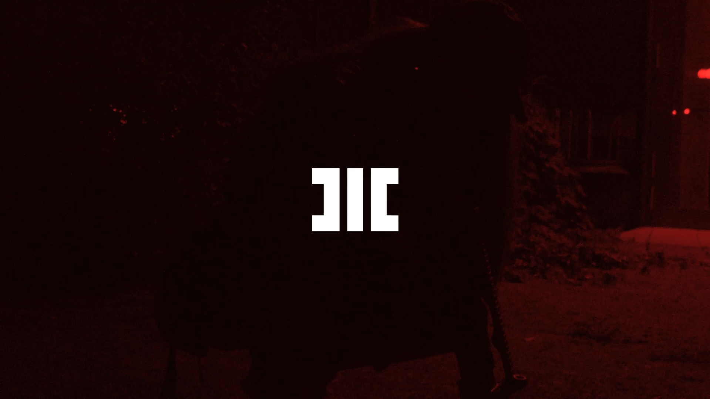

# MOTHNODE_ Identity feat. IMYRGOD

**Listen now:** https://www.dropbox.com/s/f4jmvm1lu70103l/HC_SG259_FULL_LYRICS_TEST2_LESS_MIDSCREAM5.wav?dl=0

## Project Data

Hitech Crime single transmedia release from the Origin Timeline dealing with the issues of assuming identities in life, dealing with social bonds and communities offering you a false one in exchange for acceptance and finally finding your true self on your own path.

> **Title:** Identity / **Featuring:** MOTHNODE, IMYRGOD

> **Production:**  / **Lyrics:** MOTHNODE

> **Beat:**

> **Narrative Design:** MOTHNODE

> **Music Video Credits:** MOTHNODE, IMYRGOD


## Lyrics

```

ya ya ya
out of my leauge
out of my leauge
out of my leauge
(out of my leauge)

out of my leauge brought into light
what do i see when dawn's too bright
bonded with mist sensing the blind
far too elite i can't align

it's the gentle breeze of anointment
furious drizzle from treacherous minds
content commotion i can't pay the obvious
i can't figure out when you tellin me lies

tellin' me lies

it's a disguise forming around the identities
splendid morbidity vibes within my entity
roaming the mind, forging new paths
for eternity dies folded inside my arms (DELETE MELODY FROM THIS PART)
folded inside my arms (+ MELODY)
folded inside my arms (+ MELODY)

PART BELOW: EQ IT BETTER

coz it's the feeble tease of the moments
dubious presents from murderous kind                            (marvellous kind)
opened for voided that can't tell the difference
i can't sense a thing when you fading the light 
every time i count up to demise
making me die, keeping me faint                                 / keeping my faith
fading the light, dimming the light
making me die 

/// MAKE A BRIDGE

ya ya ya
out of my leauge
out of my leauge
out of my leauge
(out of my leauge)

out of my leauge brought into light
what do i see when dawn's too bright
bonded with mist sensing the blind
far too elite i can't align

it's the gentle breeze of anointment
furious drizzle from treacherous minds
content commotion i can't pay the obvious
i can't figure out when you tellin me lies

tellin' me lies

it's a disguise forming around the identities
splendid morbidity vibes within my entity
roaming the mind, forging new paths
for eternity dies folded inside my arms 
folded inside my arms
folded inside my arms


----


it's a disguise forming around the identities
splendid morbidity vibes within my entity
roaming the mind, seeking few flaws
for eternity dies folded inside my arms 

pull up your masks of endless layers
thru which i peel
i cannot surmise to 
dare theatre of moods make it surreal 


---

turns into dust and still blows through the winds 
of a fantasy
what you amassed is close to hypocrisy
avast what you make of your moves
is up to your moods

out of my leauge brought into light
what do i see when dawn's way too bright
bonded with mist sensing the blind
far too elite i can't align

it's the gentle breeze of annointment
furious drizzle from treacherous minds
content commotion i can't pay the obvious
i can't figure when you tellin me lies


everytime i count down to demise
worlds inside my skull they agonize
for the loss

still i truly out and tell you
what are the lies
when i tell you the lies


```

## Lore Notes

**Themes:** ID motif. Identity, the id in psychology. Masks. Theatre of Sorrows. Mask of Existence. Human Fakeness. Tearing down the masks, both of the world around us and our own. Birthed anew. 


## Music Video

Tie into the **Story Arc** of the Short Cinematic Film called ID_6137. The naming is significant as the order of the numbers signifies the road from fakeness and defence to true self and attack.

Numerology:

6 - you are being held back by anxiety and fear

- In Tarot, six represents the Lovers. In this way, if you keep seeing the number six, it may be a sign you need to embrace inner peace and self-love. Similarly, when you’re being held back by anxiety or fear, it’s common to see the number 6 all around you. It lets you know that you need to find ways to move past these feelings if you’re going to manifest what you want.

1 - you may be struggling with negativity and it is time to refocus

- Seeing the number 1 suggests that you may be struggling with negativity. Plus, since you create your own reality, this number is a reminder that you may be accidentally creating more negativity. Think about why, and refocus your mind towards your desires rather than your fears to ensure you vibrate on a frequency of abundance rather than lack. Once you overcome this negativity, be sure to embrace any changes. One is a stepping stone and a number which represents beginnings.

3 - indication that source of wisdom is nearby

- The number 3 indicates that sources of love and wisdom are nearby, and are yours to benefit from. It is also often associated with luck and good fortune. So, for example, if you’re having lunch with someone and see a lot of 3s on the check, think harder about how this person might be able to help you get what you want in life. This could be the exact right time to expand your knowledge base, chase your dreams and challenge yourself. Afterall, you may have luck and wisdom on your side. This has broad applicability, so may relate to everything from love to money, achievement and personal growth.

7 - number connected to new opportunities (purposefully last on the name of the film, last number as an opening for further discovery)

The number 7 is intimately connected with new opportunities, especially ones that you weren’t expecting to come your way. It might appear in connection with job adverts, dating prospects, places to live or new classes, but no matter where you see repeated 7s you can be sure that there’s something highly advantageous hidden in plain sight. Furthermore, learn to listen to your gut. Trust your instincts when you keep seeing the number seven and prepare for a spiritual awakening.

## Short Cinematic Film

**Story Arc:** underground experiments on extreme anomalous human test subjects, schizophrenics or narcissists wearing way too many mental and literal masks. Showcasing the Tear Down procedures to unveil the Inverted Hierophant / The Corruptor within the subjects that reinforces human destructive systems pushing away the true self (core self) and hiding it under many layers of lies and avoidance.

## Miscellaneous Notes

MOTHNODE_ Identity feat. IMYRGOD (Short Cinematic Preview). Filename: HC_SG259_Identity.mp4

Camera Ops_ MOTHNODE x IMYRGOD
